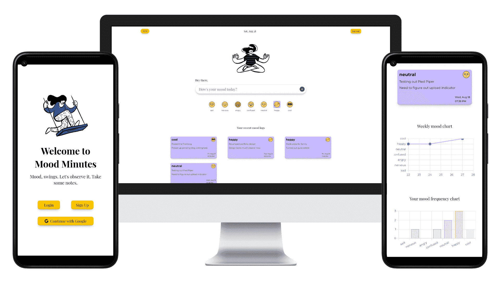

# Mood Minutes
Application to track and analyze your mood swings. Take notes, generate mood charts and observ over time.

#### live @ [mood-minutes.vercel.app/](https://mood-minutes.vercel.app/)

### Tech Stack
- ReactJS
- ChartJS

### Mockup

## Features
- User can login using email/password or Google account
- MoodSpace (as I like to call it) consists of 
  - Space to log a mood with brief note and an optional mood description panel
  - Weekly MoodChart display
  - Mood Frequency chart to show mood counts over time

  ### Todo/s:
  - Update MoodSpace theme as per current mood
  - Generate monthly mood chart
  - Display a mood summary on weekly/monthly basis

## Goal
- Self-taught web development journey exposed me to whole new mood swings. While learning new concepts, facing implementation challenges, getting comfortable and feeling inept, there's a visible curve of moods.
- Idea was to have a platform to track the swings. Recording personal mood logs overtime and having a visual representation helps analyze and act accordingly. 

## Learnings
- Using ChartJS for data representation.
- Data manipulation using various array and object methods to render different mood chart parameters.

## Challenges
- Integrating and customizing ChartJS with proper data representation.
- Averaging and filtering mood logs for better overall mood representation.

## Prospective
- Expand the scope to suggesting Spotify Playlists for specific moods.

### Attribution
Illustration by [Pablo Marquez](https://icons8.com/illustrations/author/5c3ecc70569980001df768e4) from [Ouch!](https://icons8.com/illustrations)
